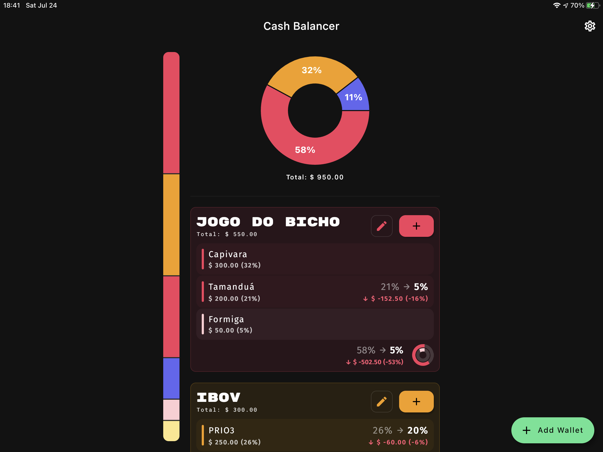
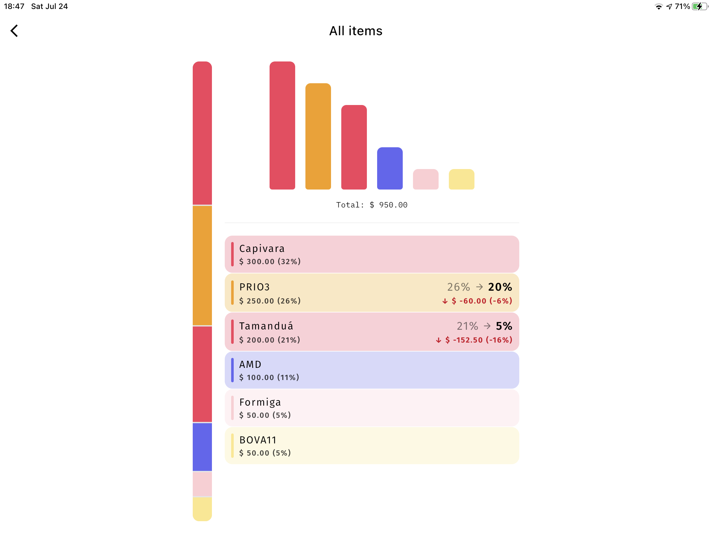
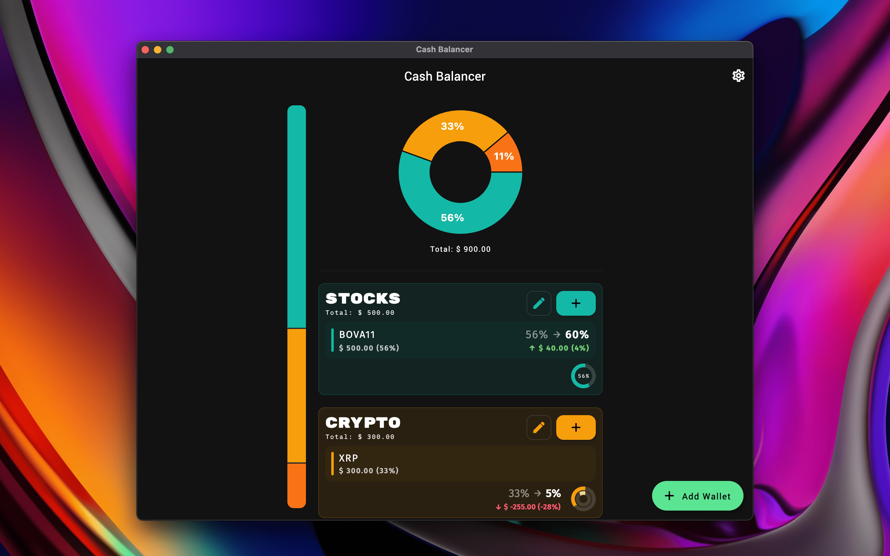
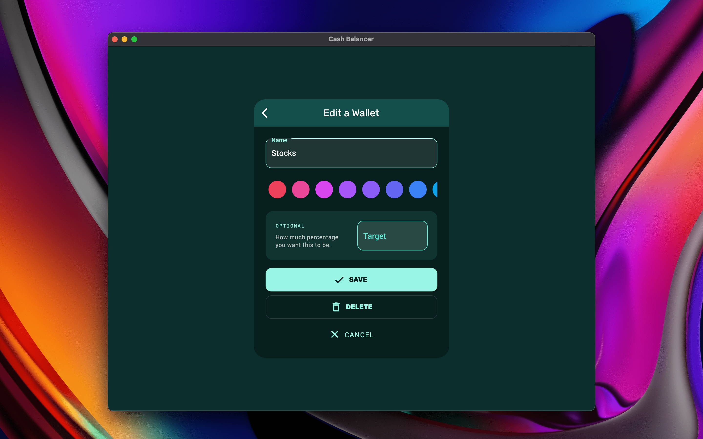

# Cash Balancer

It is too hard to balance money across different assets and accounts. Spreadsheets are too hostile; banks are too
complex. This app should help you understand your finances without the help of an expert. It works basically as a
finance calculator for asset allocation: you put what you have, how much you want to have (%), and check the difference.

[Try the web version](https://bernaferrari.github.io/CashBalancer)

Usage examples:

- You want 5% of your capital to be in crypto: 60% in Bitcoin, 30% in Ether, 10% in XRP. Tomorrow that becomes 8%, what
  and how much do you sell to stay with 5% again?
- You are following a stock recommendation with 40% of your bank account, but you are tired of calculating 12.5% of 40%
  for each position and then periodically rebalancing as you receive your wage.
- You have a complex wallet consisting of 20% of the treasury (40% in one asset, 60% in another), while 30% of offshore
  investments and 50% of stocks with different weights.

## Screenshots

| Main Screen | Analysis Screen |
|:-:|:-:|
|  |  |

| Main Screen | Edit Screen |
|:-:|:-:|
|  |  |
